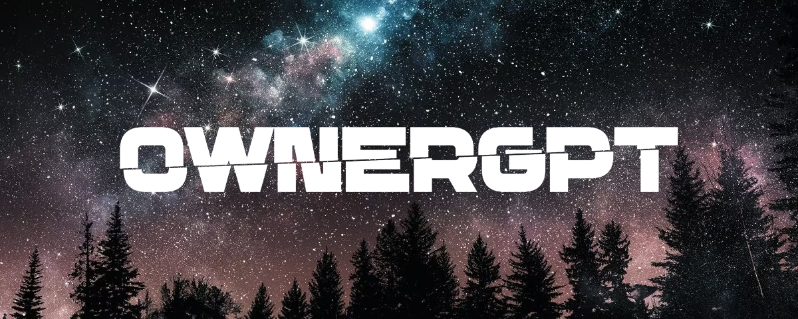

# OwnerGPT 

<h1 align="center">
  <br>
  
  <br>
</h1>

<h4 align="center"> <b>OwnerGPT</b> is a private GPT platform for maintaining and building your own domain specific GPT.</h4>

<p align="center">
  <a href="https://github.com/Naereen/badges"></a>
</p>

```
📂OwnerGPT
├── 📂OwnerGPT.LLM
├── 📂OwnerGPT.DocumentEncoder
├── 📂OwnerGPT.Plugins
    ├── 📂OwnerGPT.Plugins.API
    ├── 📂OwnerGPT.Plugins.PDF
    ├── 📂OwnerGPT.Plugins.WEB
    ├── 📂OwnerGPT.Plugins.OCR
```
